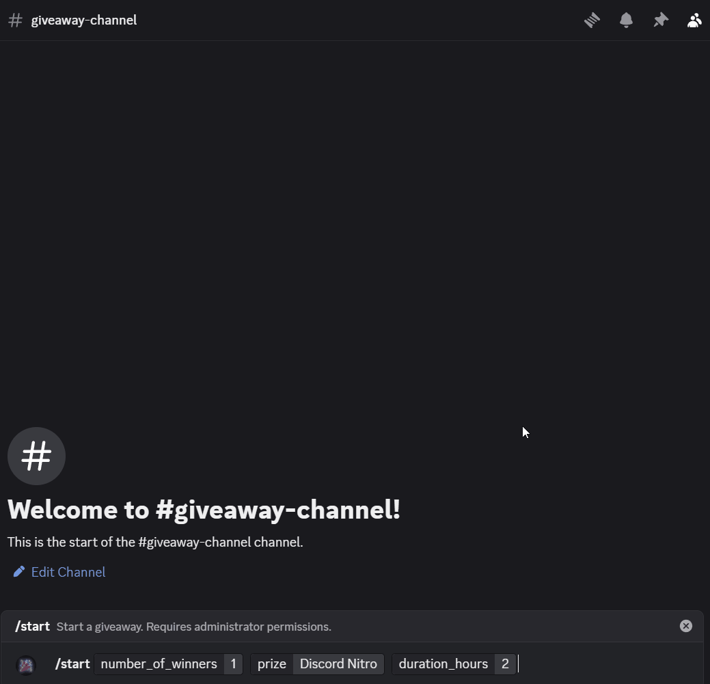

Giveaway Bot
------------
A Discord bot for hosting giveaways.


Installation
------------
1. Clone the repository:
    ```bash
    git clone https://github.com/space-beetween/discord-giveaway.git
    cd discord-giveaway
    ```
2. Install the required packages:
    ```bash
    pip install -r requirements.txt
    ```
3. Setup PostgreSQL database.
> [!NOTE] 
> You can use any DBMS, but by default, the bot is configured to use PostgreSQL with asyncpg.
> To use a different database, you will need to install the appropriate async driver and modify the connection string in the `config.yml` file.


4. Create a `config.yml` file in the root directory with your bot token and database connection string:
    ```yaml
    bot_token: "your-bot-token"
    db_uri: "postgresql+asyncpg://username:password@ip:port/database_name"
    test_guilds: [123456789123456789] # Optional
    ```

5. Run the bot:
    ```bash
    python main.py
    ```

Usage
-----
To create a giveaway, use the '/start' command.
You can specify the prize, duration in hours, and the number of winners.

To join a giveaway, click the "Join Giveaway" button in the giveaway message.

To end a giveaway ahead of waiting for the duration to expire, use "End Giveaway" button in the giveaway message.


